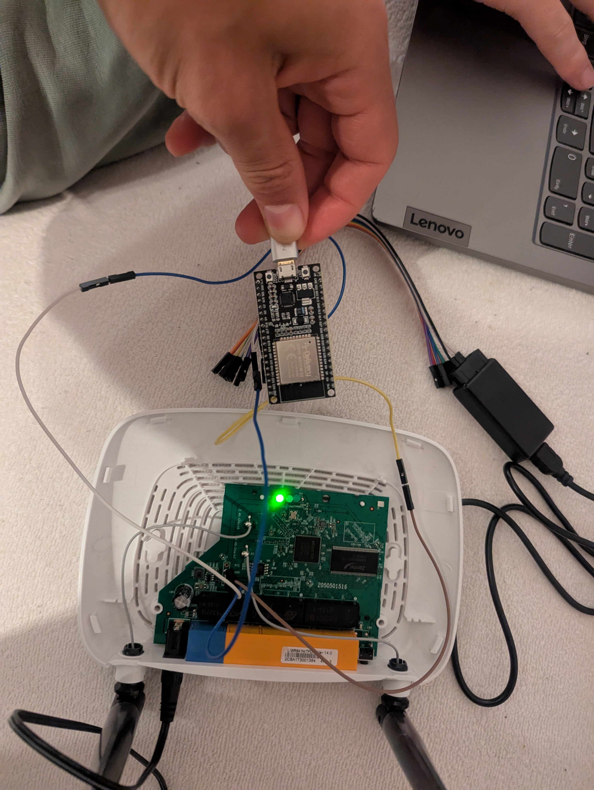

# 🛠️ UART Hacking TP-Link TL-WR841N

We attempted to gain UART shell access on a **TP-Link TL-WR841N router**, and this README documents the process, lessons learned, and some very satisfying success.

---

## 🧩 Step 1: Identify UART Pins

Fortunately, TP-Link was kind enough to **label the UART pins** on the board:

- `VCC`
- `GND`
- `RX`
- `TX`

📸 _Image: TP-Link Router_

📸 _Image: TP-Link Router Board_

📸 _Image: UART Pin Labels_

---

## 🔌 Step 2: First Attempt — USB Cable Hack

Our initial idea was to try a quick workaround by using a spare USB cable. We cut off the micro USB end, soldered female jumper wires to the internal leads, and connected them to male header pins we attached to the router’s UART pads.

With everything wired up, we launched `picocom` and tried listening at 115200 baud. Unfortunately, we received no output at all.

📸 _Image: USB cable hack_

**Result:** Nothing. No output using `picocom`.

---

## 🔬 Step 3: Logic Analyzer Debugging	

To verify that the router’s UART was actually active, we connected a logic analyzer and monitored the signals using PulseView.

We observed consistent UART traffic at 115200 baud, confirming that the router was transmitting data correctly. This suggested the issue was with how we were connecting to the laptop — not with the UART lines themselves.

📸 _Image: PulseView setup_

📸 _Image: PulseView signals_

---

## ❌ Why USB ≠ UART?

After researching the problem, we realized the USB connection wouldn’t work as intended because:

- USB is a packet-based protocol with its own drivers and controller logic.
- UART is a simple, asynchronous serial protocol that directly transmits bits over TX/RX lines.

USB and UART are **not electrically or logically compatible**, so a direct connection between a USB port and UART pins won’t work. A **USB-to-UART bridge** is required to handle the protocol conversion.
---

## 🧠 Step 4: Arduino as USB-UART Passthrough

To avoid waiting for a dedicated USB-to-UART adapter, we tried using an Arduino Uno as a pass-through device. We uploaded a simple sketch to forward data between its UART pins and USB serial connection.

This setup produced partial results — some readable output mixed with a lot of corrupted characters.

---

## ⚠️ Why Arduino Failed at 115200 Baud

The issue turned out to be related to the Arduino’s performance. At 115200 baud, the 8-bit microcontroller couldn’t consistently forward serial data without dropping bytes. This is a common limitation when using software or even hardware serial on slower boards.

---

## 💡 Step 5: ESP32 to the Rescue

We moved on to an ESP32 board, which supports multiple hardware serial interfaces and can handle high baud rates more reliably.

After setting up the wiring, we again got mixed results. Eventually, we realized that the TX and RX lines needed to be **crossed**:

- The router’s **TX** connects to the ESP32’s **RX**.
- The router’s **RX** connects to the ESP32’s **TX**.

After correcting the wiring, we received clear, readable UART output.

📸 _Image: Final working wiring with ESP32_

📸 _Image: UART with ESP32_

---

## 🐚 Step 6: Root Shell!

With everything set up properly, we connected via serial and were immediately presented with a **root shell**, without any login or password prompt. This confirmed that the device lacked any UART-level authentication.

---

## 🔐 Found: Hashed Root Password

We discovered the root password stored as an **MD5 hash** in the `/etc/passwd` file:

📸 _Image: Passwd_

We're planning to **crack this hash** next.

# 🔍 BusyBox on TP-Link TL-WR841N

While navigating the router's UART shell, we noticed that it’s using **BusyBox** — a lightweight collection of Unix utilities bundled into a single binary. It’s commonly found on embedded systems like routers because it provides essential command-line tools while keeping resource usage minimal.

📸 _Image: BusyBox_

---

## 📦 Tools Used

- TP-Link TL-WR841N
- Logic Analyzer + PulseView
- Arduino Uno
- ESP32
- `picocom`
- Soldering gear

---

## 🚧 Lessons Learned

- Don't connect USB to UART directly — always use a bridge.
- Always cross TX ↔ RX.
- Arduino is too slow for high-speed UART passthrough.
- ESP32 makes a great quick UART interface.
- Embedded devices often lack security by default ^^

---

## 🧠 Stay Curious, Hack Legally

This was done on a **personally owned router**, purely for educational purposes. Please always respect device ownership, networks, and the law.

---

🛠️ Happy hacking!

